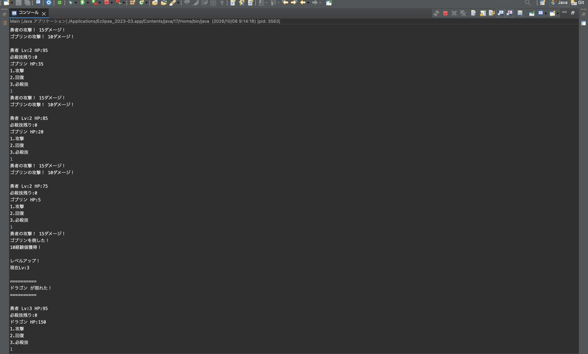

# Java RPGバトルゲーム

## 概要

Java学習のアウトプットとして作成したコンソール型RPGゲームです。

## 使用技術

- Java
- Eclipse
- Git
- GitHub

## 実装機能

- 通常攻撃
- 回復
- 必殺技
- 経験値獲得
- レベルアップ
- スライム戦
- ゴブリン戦
- ドラゴン戦

## 学習内容

- クラス
- メソッド
- コンストラクタ
- 継承
- オブジェクト指向

## 実行画面

